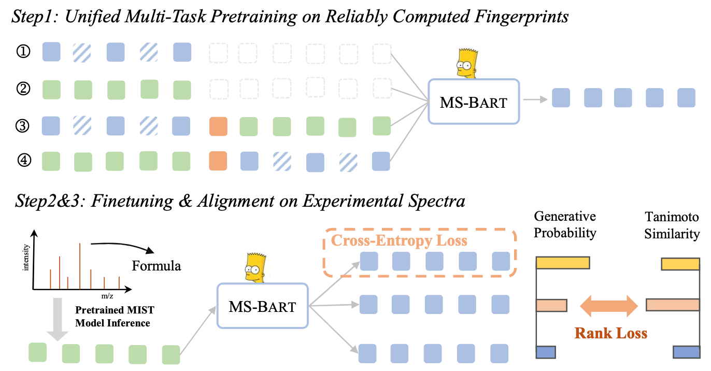

<div align="center">

<h1>MS-BART: Unified Modeling of Mass Spectra and Molecules for Structure Elucidation  (NeurIPS 2025)</h1>


[Yang Han](https://csyanghan.github.io/)<sup>1,2</sup>, [Pengyu Wang](https://peng-yuwang.github.io/Pengyu-page/)<sup>1,2</sup>, [Kai Yu](https://x-lance.sjtu.edu.cn/~kaiyu/)<sup>1,2</sup>, [Xin Chen](https://openreview.net/profile?id=~xin_chen66)<sup>2</sup>, [Lu Chen](https://coai-sjtu.github.io/)<sup>1, 2</sup>

<sup>1</sup> X-LANCE Lab, Shanghai Jiao Tong University, Shanghai  <sup>2</sup> Suzhou Laboratory, Suzhou.


<a href="https://arxiv.org/abs/2510.20615" target="_blank"  style="margin-right: 4px;"></a>
<a href='https://modelscope.cn/studios/csyanghan/MS-BART/'></a>

</div>


> **TL; DR:**  MS-BART is the first to leverage language model for mass spectra structure elucidation by introducing a unified vocabulary and enabling end-to-end pretraining, fine-tuning, and alignment.

<p align="center">
  
</p>


## Environment Setup

```bash
conda env create -f environment.yml
conda activate ms-bart
```

## Preprocessed Dataset and Model Weights

You can download the preprocessed and model weight from the [Figshare](https://figshare.com/articles/dataset/MS-BART-Model-Weights-Data/30393544) and put them in data folder.

The folder tree are:

```
data
├─ CANOPUS
│  ├─ mist
│  ├─ model-weights # The final MS-BART model on CANOPUS dataset
|  ├─ pretrain-data # clean pretrain data (filter Tanimoto similarity > 0.5)
|  ├─ pretrained-model # pretrain on clean 4M pretrain dataset
│  ├─ train
│  ├─ test
│  ├─ val
├─ MassSpecGym
│  ├─ mist # retrained with clean CANOPUS dataset
│  ├─ model-weights # The final MS-BART model on MassSpecGym dataset
|  ├─ pretrain-data
|  ├─ pretrained-model
│  ├─ train
│  ├─ test
│  ├─ val
```

Or you can download the original data preprocee and train from scratch

```
# Pretrain dataset generation and split 10000 for validation to choose the best model for finetune and alignment
python preprocess/generate_pretrain_data.py
python preprocess/split_pretrain_dataset.py

# generate the fingerprint and split into train/val/test following the raw  division
python preprocess/generate_canopus_and_lables.py
python preprocess/generate_mgf_and_lables.py
python preprocess/fp_pred_main.py
python preprocess/prepare_test_data.py
```

## Step1: Unified Multi-Task Pretraining on Reliably Computed Fingerprints

```bash
bash scripts/pretrain.sh
```

## Step2: Finetuning on Experimental Spectra

```bash
bash scripts/msg/finetune.sh

bash scripts/canopus/finetune.sh
```

## Step3: Contrastive Alignment via Chemical Feedback

```bash
bash scripts/msg/align.sh

bash scripts/canopus/align.sh
```

## Evaluation

```bash
bash scripts/msg/eval.sh

bash scripts/msg/eval.sh
```

## Contact

If you have any questions, please reach out to csyanghan@sjtu.edu.cn